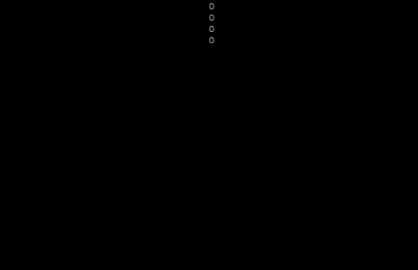

# Tetrust

## Intent

- Attempt to make use of data-oriented design
- Attempt to make use entity systems
- Practice rust
- Use a TUI (cuz tuis are cool)

## Goals

- Basic tetris rules
    - fixed sized grid
    - blocks fall one at a time
    - end game when top of screen reached

- Basic tetris mechanics
    - tetromino gravity
    - rotating tetrominos
    - dropping tetrominos
    - clearing lines
    - score

- Extensions
    - game music
    - ai/autoplay
    - ai/competitive
    - multiplayer
    - network multiplayer

### Steps

- [X] [Get a tetromino to render](https://github.com/scottnm/tetrust/commit/76babe55dcab890374494fc912e77d16b2fe0e48)

- [X] [Get a tetromino to fall](https://github.com/scottnm/tetrust/commit/f3aca54cb39c7137e0c38f52fd2c4c8d9f23af4b)

- [X] [Get tetrominos to stack on each other and floor](https://github.com/scottnm/tetrust/commit/915e61e7d227fea6e134da75f864629514f3c9f8)

- [ ] Generate tetrominos based on game rules
- [ ] Constrain board size
- [ ] Allow tetrominos to rotate
- [ ] Allow clearing lines
- [ ] Generate/Preview random blocks
- [ ] Handle game lose state
- [ ] Handle scoring

