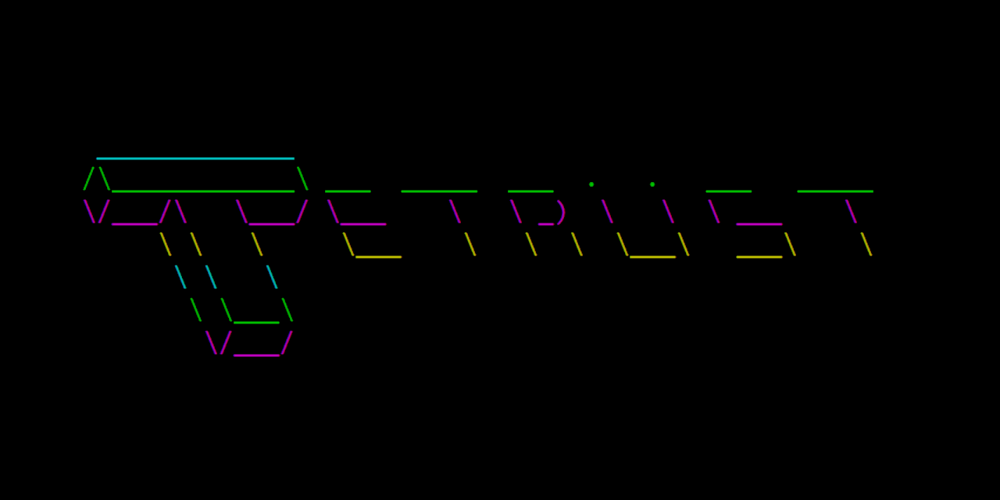
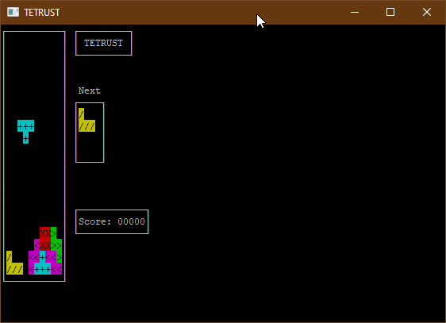

<!-- sadly it'd be cool to render the cover/logo using the ascii art itself, but  I don't think that will read as well w/ accessibility tools like screen readers -->

# Tetrust

Tetrust is a tetris clone built as a text user interface (TUI) using [rust](https://www.rust-lang.org).

### Controls

|key|control|
|---|-------|
|`A`|move tetromino left|
|`D`|move tetromino right| 
|`S`|drop tetromino|
|Left arrow|rotate tetromino left|
|Right arrow|rotate tetromino right|
|`P`|pause|
|`ESC`|quit game early|

## Index

- [Why?](#why)
- [Known gaps](#known-gaps)
- [Installation](#installation)
- [v1.0 Features](#v1.0-features)
- [vNext Ideas](#vnext-ideas)
- [A history in gifs](#a-history-in-gifs)
- [project reflections](#project-reflections)

## Why?

Why did I spend my time working on this?

- I wanted to write more rust code
- I wanted to write a TUI game
- Initially I had aspirations this might be a good playground to experiment with data-oriented design and entity-component systems. That never panned out, but it was an original motivator.
- I found it super creatively gratifying to make something to a semi-polished "v1" state.

## Known gaps

As this is a personal project, there are a lot of gaps in functionality and polish. Notable ones include:

- no in-game control explanations
- no SFX
- no installer

Nevertheless, I still consider the game, emotionally, in a V1 state. Bear with me :)

## Installation

There is currently no installer. To install and play the game, you'll need to build and run from source which isn't too gnarly. As a prerequisite you'll need a reasonably up-to-date rust installation.

1. clone this repo
2. `cargo run --release`

## v1.0 Features

Despite 

- Basic tetris rules
    - Blocks fall and rotate
    - Lines can be cleared
    - Blocks fall faster as more lines are cleared
- Classic arcade-style leaderboard
- Separate start, game, and leaderboard screens

## vNext Ideas

- game music
- SFX
- AI match
- Multiplayer match
- Network multiplayer

## A history in gifs

As I was working on the project I thought it'd be fun to record each milestone in a gif to demonstrate progress. Here they are in reverse chronological order w/ attached commits:

- [Automated CI/CD testing](https://github.com/scottnm/tetrust/commit/2da6b6a456d97472b1790d94c260deb8cd8ba0bf)

- [Add leaderboard](https://github.com/scottnm/tetrust/commit/d09425ff29ce4617cbe1d3dec9d45a0e845e51d6)

- [Add start screen](https://github.com/scottnm/tetrust/commit/93b6d95)

- [Handle quick drop and show drop preview](https://github.com/scottnm/tetrust/commit/d97b914)

- [Speed up pieces falling as more lines are cleared](https://github.com/scottnm/tetrust/commit/79aae07b823af30b06091c22f96c8760d80cdb60)

- [Scoring and line clears](https://github.com/scottnm/tetrust/commit/b330acb)

- [Handle pausing](https://github.com/scottnm/tetrust/commit/364add645b291dd330ccb3817eae0988b9a761e3)

- [Preview blocks](https://github.com/scottnm/tetrust/commit/c8e859c5857bb7a48843ab7108bff9692a0370e0)

- [Allow tetrominos to rotate](https://github.com/scottnm/tetrust/commit/3dd8bba32517b65c19e1ad4082612eb287630734)

- [Constrain board size and add game over screen](https://github.com/scottnm/tetrust/commit/44bbeee4d17255c68c0f7c96ebe29a6b6c151b2a)

- [Handle game lose state](https://github.com/scottnm/tetrust/commit/b72efb7eb834d442885c35f5cbb8173c2b1ba887)
- [Handle left-right inputs](https://github.com/scottnm/tetrust/commit/a819261fdfd041bd8fbcc280d9661e78f355bdcd)

- [Add some sort of test framework](https://github.com/scottnm/tetrust/commit/2d4fbc7ba4b3579150d3a3c889dd88d99c34e578)

- [Generate tetrominos based on game rules](https://github.com/scottnm/tetrust/commit/b72efb7eb834d442885c35f5cbb8173c2b1ba887)

- [Add color to tetrominoes](https://github.com/scottnm/tetrust/commit/1c547fc7bc0d701fa8e7117592c61a0a5b693840)

- [Get tetrominos to stack on each other and floor](https://github.com/scottnm/tetrust/commit/915e61e7d227fea6e134da75f864629514f3c9f8)

- [Get a tetromino to fall](https://github.com/scottnm/tetrust/commit/f3aca54cb39c7137e0c38f52fd2c4c8d9f23af4b)

- [Get a tetromino to render](https://github.com/scottnm/tetrust/commit/76babe55dcab890374494fc912e77d16b2fe0e48)

## Project reflections

- V1 (Jan 18. 2021)
    - Tetris has some surprisingly interesting and complex rules that have changed and been tuned across it's many iterations. The one I found most interesting (which I still don't really have a good implemenation for) was that many tetris games iterated on how pieces were allowed to rotate. In some early forms it was super simple but as the game was re-implemented and improved it became more complex. The gold standard for tetris games now usually requires some for wall kicking.
    - As I was closing in on V1, it was wild to look back at the first commit in the repo. I started the project in mid 2019 and dropped it after making some sizable progress but running into a blocker with how I wanted to constrain the tetris board. It was super emotionally gratifying to come back to the project a year and a  half later, unblock myself, and get to a V1. Tying up loose ends is a special sort of satisfying.

To be continue...?
